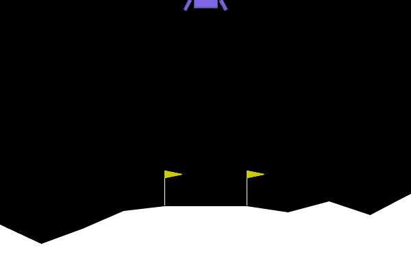

      
# Multi-Agent Lunar Lander Projekt (DHBW Mannheim - Kurs Artifcial Intelligence)

Dieses Projekt implementiert und vergleicht eine erweiterte Auswahl an Agententypen zur Lösung der LunarLander-v3 Umgebung von Gymnasium (ehemals OpenAI Gym). Es beinhaltet nun einen Zufallsagenten, verschiedene Reinforcement Learning Agenten wie Deep Q-Network (DQN), REINFORCE (Monte Carlo Policy Gradient), Advantage Actor-Critic (A2C) und Proximal Policy Optimization (PPO), sowie evolutionäre Ansätze wie einen Genetischen Algorithmus (GA) und Evolutionäre Strategien (ES) für direkte Policy-Suche. Das Hauptziel ist es, ein modulares und erweiterbares Framework für das Training dieser vielfältigen Agenten, die Bewertung ihrer Leistung und den direkten Vergleich ihrer Effektivität und Lerneigenschaften bereitzustellen. Die Projektstruktur wurde überarbeitet, um separate Skripte für Training (`train.py`), individuelles Testen (`test.py`) und vergleichende Evaluierung (`evaluate.py`) zu nutzen, wobei Konfigurationen zentral in `config.py` verwaltet werden. Dieses Projekt wurde im Rahmen des Kurses "Künstliche Intelligenz" an der DHBW Mannheim unter der Leitung von Prof. Dr. Maximillian Scherer entwickelt.

## Inhaltsverzeichnis

- [Multi-Agent Lunar Lander Projekt (DHBW Mannheim - Kurs Artifcial Intelligence)](#multi-agent-lunar-lander-projekt-dhbw-mannheim---kurs-artifcial-intelligence)
  - [Inhaltsverzeichnis](#inhaltsverzeichnis)
  - [Projektübersicht](#projektübersicht)
  - [Funktionen](#funktionen)
  - [Ordnerstruktur](#ordnerstruktur)
  - [Setup und Installation](#setup-und-installation)
    - [Voraussetzungen](#voraussetzungen)
    - [Installationsschritte](#installationsschritte)
  - [Ausführung der Skripte](#ausführung-der-skripte)
    - [Konfigurationsdatei (`config.py`)](#konfigurationsdatei-configpy)
    - [Training der Agenten (`train.py`)](#training-der-agenten-trainpy)
    - [Testen eines einzelnen Agenten (`test.py`)](#testen-eines-einzelnen-agenten-testpy)
    - [Vergleichende Evaluierung aller Agenten (`evaluate.py`)](#vergleichende-evaluierung-aller-agenten-evaluatepy)
  - [Funktionsweise - Implementierung der Agenten](#funktionsweise---implementierung-der-agenten)
    - [Basis-Agent (`agents/base_agent.py`)](#basis-agent-agentsbase_agentpy)
    - [Zufallsagent (`agents/random_agent.py`)](#zufallsagent-agentsrandom_agentpy)
    - [Deep Q-Network (DQN) Agent (`agents/dqn_agent.py`)](#deep-q-network-dqn-agent-agentsdqn_agentpy)
    - [REINFORCE (Monte Carlo Policy Gradient) Agent (`agents/reinforce_agent.py`)](#reinforce-monte-carlo-policy-gradient-agent-agentsreinforce_agentpy)
    - [Advantage Actor-Critic (A2C) Agent (`agents/a2c_agent.py`)](#advantage-actor-critic-a2c-agent-agentsa2c_agentpy)
    - [Proximal Policy Optimization (PPO) Agent (`agents/ppo_agent.py`)](#proximal-policy-optimization-ppo-agent-agentsppo_agentpy)
    - [Genetischer Algorithmus (GA) Agent (`agents/genetic_agent.py`)](#genetischer-algorithmus-ga-agent-agentsgenetic_agentpy)
    - [Evolutionäre Strategien (ES) Agent (`agents/es_agent.py`)](#evolutionäre-strategien-es-agent-agentses_agentpy)
  - [Qualitative Evaluierung der Agenten](#qualitative-evaluierung-der-agenten)
      - [RANDOM Agent](#random-agent)
      - [DQN Agent](#dqn-agent)
      - [GENETIC Agent](#genetic-agent)
      - [REINFORCE Agent](#reinforce-agent)
      - [A2C Agent](#a2c-agent)
      - [PPO Agent](#ppo-agent)
      - [ES Agent](#es-agent)
  - [Quantitative Evaluierung der Agenten](#quantitative-evaluierung-der-agenten)
  - [Quellen und Inspirationen](#quellen-und-inspirationen)

## Projektübersicht

Das Ziel dieses Projekts ist die Erforschung und der Vergleich verschiedener intelligenter Agenten zur Lösung der anspruchsvollen "LunarLander-v3"-Umgebung aus der Gymnasium-Bibliothek (ehemals OpenAI Gym). In dieser Simulationsumgebung muss ein Agent lernen, ein Raumschiff sanft und präzise auf einer vorgegebenen Landeplattform zwischen zwei Flaggen zu landen. Der Agent erhält kontinuierlich Informationen über den Zustand des Landers – wie Position, Geschwindigkeit, Winkel, Winkelgeschwindigkeit und ob die Beine Bodenkontakt haben – und muss basierend darauf diskrete Aktionen auswählen: nichts tun, das linke Ausrichtungstriebwerk, das Haupttriebwerk oder das rechte Ausrichtungstriebwerk zünden. Eine erfolgreiche Landung wird hoch belohnt, während Abstürze, das Verlassen des vorgesehenen Bereichs oder übermäßiger Treibstoffverbrauch bestraft werden, was eine komplexe Optimierungsaufgabe darstellt.

Um dieser Herausforderung zu begegnen, implementiert das Projekt ein breites Spektrum an Agenten-Architekturen:
*   Einen **Zufallsagenten** als Baseline.
*   Fortschrittliche **Reinforcement Learning (RL)** Algorithmen:
    *   **Deep Q-Network (DQN):** Ein wertbasierter Ansatz, der Q-Werte mittels neuronaler Netze approximiert.
    *   **REINFORCE:** Ein klassischer Monte-Carlo Policy-Gradienten-Algorithmus.
    *   **Advantage Actor-Critic (A2C):** Ein Policy-Gradienten-Algorithmus, der sowohl eine Policy (Actor) als auch eine Wertefunktion (Critic) lernt, um die Varianz der Gradientenschätzungen zu reduzieren.
    *   **Proximal Policy Optimization (PPO):** Ein moderner und robuster Policy-Gradienten-Algorithmus, der für seine Stabilität und gute Performance bekannt ist.
*   **Evolutionäre Algorithmen:**
    *   **Genetischer Algorithmus (GA):** Ein populationsbasierter Ansatz, der die Prinzipien der natürlichen Selektion nutzt, um Policy-Netzwerke zu optimieren.
    *   **Evolutionäre Strategien (ES):** Eine Methode der direkten Policy-Suche, die Parameter eines Policy-Netzwerks durch iterative Perturbation und Selektion optimiert.

Das Projekt ist modular aufgebaut, mit einer klaren Trennung der Verantwortlichkeiten:
*   Die **Agentenimplementierungen** befinden sich im `agents/` Verzeichnis.
*   Eine zentrale **Konfigurationsdatei (`config.py`)** ermöglicht die einfache Anpassung aller relevanten Parameter.
*   Separate Python-Skripte steuern die Hauptprozesse:
    *   `train.py`: Dient dem Training der lernfähigen Agenten.
    *   `test.py`: Ermöglicht das visuelle Testen eines einzelnen, ausgewählten Agenten.
    *   `evaluate.py`: Führt eine vergleichende Evaluierung aller trainierten Agenten durch und generiert Leistungsmetriken.

Das übergeordnete Ziel ist es, ein flexibles Framework zu schaffen, das nicht nur die Implementierung und den Vergleich dieser spezifischen Agenten ermöglicht, sondern auch leicht um weitere Algorithmen erweitert werden kann. Die Ergebnisse und Erkenntnisse dieses Projekts wurden im Rahmen des Kurses "Künstliche Intelligenz" an der DHBW Mannheim unter der Leitung von Prof. Dr. Maximillian Scherer erarbeitet.

## Funktionen

Dieses Projekt bietet eine umfassende Sammlung von Funktionen, die das Experimentieren mit und Vergleichen von verschiedenen Agenten im LunarLander-Umfeld ermöglichen:

*   **Vielfältige Agenten-Implementierungen:**
    *   **Zufallsagent (`RandomAgent`):** Dient als grundlegende Baseline. Er wählt Aktionen rein zufällig aus dem Aktionsraum aus, ohne jegliches Lernen oder Optimierung.
    *   **Deep Q-Network (`DQNAgent`):** Ein wertbasierter RL-Algorithmus. Er nutzt ein neuronales Netz, um die Q-Funktion (erwarteter Return für eine Zustands-Aktions-Paarung) zu approximieren. Kernkomponenten sind ein Experience Replay Buffer zur Entkorrelierung von Erfahrungen und ein separates Zielnetzwerk (Target Network) zur Stabilisierung des Lernprozesses. Verwendet Epsilon-Greedy-Exploration.
    *   **REINFORCE (`REINFORCEAgent`):** Ein Monte-Carlo Policy-Gradienten-Algorithmus. Er lernt eine Policy direkt, indem er die Wahrscheinlichkeiten von Aktionen basierend auf den am Ende einer Episode gesammelten, diskontierten Returns anpasst. Updates erfolgen episodisch.
    *   **Advantage Actor-Critic (`A2CAgent`):** Ein Actor-Critic-Algorithmus. Der "Actor" (Policy-Netzwerk) entscheidet über die Aktionen, während der "Critic" (Value-Netzwerk) den Wert des aktuellen Zustands schätzt. Der Actor wird basierend auf dem "Advantage" (Differenz zwischen dem tatsächlichen Return und der Schätzung des Critics) aktualisiert, was die Varianz der Gradienten reduziert. Ein Entropie-Bonus fördert die Exploration.
    *   **Proximal Policy Optimization (`PPOAgent`):** Ein moderner Actor-Critic-Algorithmus, der für seine Stabilität und Effizienz bekannt ist. Er verwendet eine "Clipped Surrogate Objective Function", um zu große Policy-Updates zu verhindern und sammelt typischerweise Erfahrungen über einen bestimmten Horizont, bevor mehrere Optimierungsepochen auf diesen Daten durchgeführt werden. Nutzt oft Generalized Advantage Estimation (GAE).
    *   **Genetischer Algorithmus (`GeneticAgent` & `GeneticAlgorithmController`):** Ein evolutionärer Ansatz. Eine Population von Policy-Netzwerken ("Individuen") wird über mehrere Generationen entwickelt. In jeder Generation werden die Individuen basierend auf ihrer Fitness (durchschnittliche Belohnung in der Umgebung) evaluiert. Bessere Individuen werden für die Reproduktion (mittels Crossover und Mutation ihrer Netzwerkparameter) ausgewählt, um die nächste Generation zu erzeugen. Elitismus sorgt dafür, dass die besten Individuen erhalten bleiben.
    *   **Evolutionäre Strategien (`ESAgent`):** Eine Methode der direkten Policy-Suche. Ein zentrales Policy-Netzwerk wird iterativ verbessert. In jedem Schritt wird eine Population von leicht modifizierten Versionen der zentralen Policy-Parameter (durch Addition von Gaußschem Rauschen) erzeugt. Diese modifizierten Parameter werden evaluiert, und die zentralen Parameter werden in Richtung der erfolgreicheren Modifikationen angepasst.

*   **Modulare und Erweiterbare Architektur:**
    *   **Basis-Agent (`BaseAgent`):** Alle Agenten erben von einer abstrakten Basisklasse, die eine konsistente Schnittstelle (`select_action`, `learn`, `reset`, `save`, `load`) definiert und die Integration neuer Agenten erleichtert.
    *   **Separate Skripte:** Die klare Trennung in `train.py`, `test.py` und `evaluate.py` verbessert die Übersichtlichkeit und ermöglicht fokussierte Operationen.
    *   **Zentrale Konfiguration (`config.py`):** Alle wichtigen Hyperparameter, Modellpfade, Trainings- und Evaluierungseinstellungen sind an einem Ort gebündelt, was die Anpassung und das Experimentieren vereinfacht.

*   **Flexibles Training und Laden von Modellen:**
    *   **Selektives Training:** Das `train.py`-Skript prüft, ob bereits trainierte Modelldateien existieren. Das Training wird für bereits vorhandene Modelle übersprungen, es sei denn, ein explizites Neutraining wird über Flags in `config.py` erzwungen (`FORCE_RETRAIN_AGENT_TYPE`).
    *   **Modellspeicherung:** Trainierte Modelle (Netzwerkgewichte) werden automatisch im `models/` Verzeichnis gespeichert, was die Wiederverwendung und spätere Analyse ermöglicht.

*   **Umfassende Test- und Evaluierungsmöglichkeiten:**
    *   **Individuelles Testen (`test.py`):** Ermöglicht die Auswahl eines spezifischen trainierten Agenten über Kommandozeilenargumente und dessen visuelle Demonstration in der Umgebung über mehrere Durchläufe.
    *   **Vergleichende Evaluierung (`evaluate.py`):** Lädt alle verfügbaren trainierten Agenten und führt eine standardisierte Evaluierung über eine konfigurierbare Anzahl von Episoden durch.
    *   **Leistungsmetriken:** Sammelt und berechnet Statistiken wie durchschnittliche Belohnung, Standardabweichung der Belohnung, minimale/maximale Belohnung und durchschnittliche Anzahl der Schritte pro Episode.
    *   **Ergebnisdarstellung:** Die Evaluierungsergebnisse werden übersichtlich als Tabelle in der Konsole ausgegeben und zusätzlich in einer CSV-Datei (`evaluation_summary.csv` im `models/` Ordner) für eine weiterführende Analyse und Dokumentation gespeichert.

*   **Reproduzierbarkeit und Visualisierung:**
    *   **Seeding:** Durchgängige Verwendung von Zufallsgenerator-Seeds (global und pro Episode/Lauf, wo sinnvoll) zur Förderung der Reproduzierbarkeit von Trainings- und Evaluierungsläufen.
    *   **Live-Rendering:** Möglichkeit, die Agenten während des Testens (`test.py`) und optional während der Evaluierung (`evaluate.py`) live in Aktion zu sehen, indem der `render_mode` entsprechend konfiguriert wird.

*   **Umgebungsintegration:**
    *   Nutzung der `LunarLander-v3` Umgebung aus der Gymnasium-Bibliothek.

Dieses Funktionsset macht das Projekt zu einer robusten Plattform für das Erlernen, Implementieren und Vergleichen einer breiten Palette von KI-Agenten im Kontext des Reinforcement Learning und der evolutionären Berechnung.

## Ordnerstruktur

Die Projektdateien sind wie folgt organisiert, um eine klare Trennung der Verantwortlichkeiten und eine gute Übersichtlichkeit zu gewährleisten:

```text
lunar_lander_agents/
├── agents/                     # Verzeichnis für alle Agentenimplementierungen
│   ├── __init__.py           # Macht 'agents' zu einem Python-Paket und exportiert Agentenklassen
│   ├── base_agent.py         # Abstrakte Basisklasse, von der alle Agenten erben
│   ├── random_agent.py       # Implementierung des Zufallsagenten
│   ├── dqn_agent.py          # Implementierung des Deep Q-Network (DQN) Agenten
│   ├── reinforce_agent.py    # Implementierung des REINFORCE (Policy Gradient) Agenten
│   ├── a2c_agent.py          # Implementierung des Advantage Actor-Critic (A2C) Agenten
│   ├── ppo_agent.py          # Implementierung des Proximal Policy Optimization (PPO) Agenten
│   ├── genetic_agent.py      # Implementierung des Genetischen Algorithmus (GA) Agenten und des zugehörigen Controllers
│   └── es_agent.py           # Implementierung des Evolutionäre Strategien (ES) Agenten/Controllers
│
├── gifs/                       # Verzeichnis für generierte GIF-Animationen der Testläufe
│   ├── random_agent_example.gif # Beispiel: GIF für den Random Agent
│   └── ppo_agent_example.gif    # Beispiel: GIF für den PPO Agent
│
├── models/                     # Verzeichnis für gespeicherte Modelle und Evaluierungsergebnisse
│   ├── dqn_lunar_lander.pth    # Beispiel: Gespeichertes Modell für den DQN-Agenten
│   ├── ga_best_lunar_lander.pth # Beispiel: Gespeichertes Modell für den GA-Agenten
│   ├── reinforce_lunar_lander.pth # Beispiel: Gespeichertes Modell für REINFORCE
│   ├── a2c_lunar_lander.pth    # Beispiel: Gespeichertes Modell für A2C
│   ├── ppo_actor_lunar_lander.pth # Beispiel: Gespeichertes Actor-Modell für PPO
│   ├── ppo_critic_lunar_lander.pth# Beispiel: Gespeichertes Critic-Modell für PPO
│   ├── es_lunar_lander.pth     # Beispiel: Gespeichertes Modell für ES
│   └── evaluation_summary.csv  # CSV-Datei mit den Ergebnissen der vergleichenden Evaluierung
│
├── config.py                   # Zentrale Konfigurationsdatei für alle Skripte und Parameter
├── train.py                    # Skript zum Trainieren der verschiedenen lernfähigen Agenten
├── test.py                     # Skript zum visuellen Testen und zur GIF-Erstellung
├── evaluate.py                 # Skript zur vergleichenden Evaluierung aller trainierten Agenten
├── requirements.txt            # Liste der Python-Paketabhängigkeiten
└── README.md                   # Diese Beschreibungsdatei
```

*Hinweis: Die `.pth`-Modelldateien, `.gif`-Dateien und die `evaluation_summary.csv` in den entsprechenden Unterordnern werden erst nach der erfolgreichen Ausführung der Skripte (`train.py`, `test.py`, `evaluate.py`) erstellt.*

## Setup und Installation

Um das Projekt lokal auszuführen, folgen Sie bitte diesen Schritten:

### Voraussetzungen

*   **Python:** Version 3.8 oder höher wird empfohlen.
*   **pip:** Der Python Paketinstaller (ist normalerweise bei aktuellen Python-Installationen enthalten).
*   **Git:** (Optional, aber empfohlen) Für das Klonen des Repositories und die Versionskontrolle.
*   **(Optional für GPU-Beschleunigung):** Wenn Sie die neuronalen Netze (insbesondere für DQN, A2C, PPO) auf einer NVIDIA-GPU trainieren möchten, benötigen Sie:
    *   Eine kompatible NVIDIA-GPU.
    *   Installierte CUDA-Treiber.
    *   PyTorch mit CUDA-Unterstützung (wird durch `requirements.txt` installiert, wenn CUDA auf Ihrem System korrekt eingerichtet ist).

### Installationsschritte

1.  **Projektdateien beziehen:**
    *   **Manuell** Laden Sie die Projektdateien herunter und entpacken Sie sie in ein Verzeichnis Ihrer Wahl. Navigieren Sie anschließend in dieses Verzeichnis.

2.  **Virtuelle Umgebung erstellen (dringend empfohlen):**
    Eine virtuelle Umgebung isoliert die Projektabhängigkeiten von Ihrer globalen Python-Installation.
    ```bash
    python -m venv .venv 
    ```
    Aktivieren Sie die virtuelle Umgebung:
    *   Unter macOS/Linux:
        ```bash
        source .venv/bin/activate
        ```
    *   Unter Windows (PowerShell):
        ```bash
        .\.venv\Scripts\Activate.ps1
        ```
    *   Unter Windows (CMD):
        ```bash
        .venv\Scripts\activate.bat
        ```
    Sie sollten nun `(.venv)` am Anfang Ihrer Kommandozeilen-Eingabeaufforderung sehen.

3.  **Abhängigkeiten installieren:**
    Stellen Sie sicher, dass Sie sich im Hauptverzeichnis des Projekts befinden (wo die `requirements.txt`-Datei liegt) und die virtuelle Umgebung aktiviert ist. Führen Sie dann aus:
    ```bash
    pip install -r requirements.txt
    ```
    Dies installiert alle notwendigen Bibliotheken, einschließlich `gymnasium[box2d]` (für die LunarLander-Umgebung), `numpy` (für numerische Berechnungen), `torch` (PyTorch für neuronale Netze) und `matplotlib` (für optionale Plots im Notebook).

4.  **(Optional) Verzeichnis für Modelle erstellen:**
    Obwohl die Skripte versuchen, das `models/`-Verzeichnis bei Bedarf zu erstellen, können Sie es auch manuell anlegen:
    ```bash
    mkdir models
    ```

Nach diesen Schritten ist das Projekt bereit zur Ausführung.

## Ausführung der Skripte

Das Projekt ist in drei Hauptskripte unterteilt: `train.py` zum Trainieren der Agenten, `test.py` zum visuellen Testen einzelner Agenten und `evaluate.py` für einen Leistungsvergleich aller Agenten. Die meisten Einstellungen werden zentral in `config.py` verwaltet.

### Konfigurationsdatei (`config.py`)

Bevor Sie die Skripte ausführen, sollten Sie einen Blick in die `config.py`-Datei werfen. Hier können Sie zentrale Aspekte des Projekts anpassen, darunter:
*   `ENV_ID`: Die zu verwendende Gymnasium-Umgebung (standardmäßig "LunarLander-v3").
*   `SEED`: Ein globaler Seed für Zufallsgeneratoren zur Förderung der Reproduzierbarkeit.
*   `AGENT_TYPES`: Eine Liste der Agententypen, die von `train.py` und `evaluate.py` berücksichtigt werden sollen (z.B. "random", "dqn", "reinforce", "a2c", "ppo", "genetic", "es").
*   `MODEL_DIR`, `*_MODEL_PATH`, `EVALUATION_CSV_PATH`: Pfade und Dateinamen für das Speichern und Laden von Modellen sowie der Evaluierungs-CSV. Stellen Sie sicher, dass das `MODEL_DIR` existiert oder von den Skripten erstellt werden kann.
*   `FORCE_RETRAIN_*`: Flags (z.B. `FORCE_RETRAIN_DQN`, `FORCE_RETRAIN_ALL`), um ein Neutraining spezifischer Agententypen (oder aller) zu erzwingen, auch wenn bereits Modelldateien existieren.
*   **Trainingsparameter für jeden Agententyp:**
    *   Anzahl der Trainings-Episoden, Generationen oder Gesamt-Zeitschritte (z.B. `DQN_TRAIN_EPISODES`, `GA_N_GENERATIONS`, `PPO_TOTAL_TIMESTEPS`).
    *   Maximale Schritte pro Trainingsepisode.
    *   Ziel-Punktzahlen (`*_SCORE_TARGET`), bei deren Erreichen das Training ggf. vorzeitig beendet wird.
    *   Häufigkeit von Statusausgaben (`*_PRINT_EVERY`).
    *   Spezifische Hyperparameter für jeden Algorithmus (Lernraten, Diskontierungsfaktoren, Netzwerkarchitektur-Parameter wie `*_FC1_UNITS`, Batch-Größen, Koeffizienten für Entropie oder Value Loss, PPO-spezifische Werte wie `PPO_CLIP_EPSILON`, GA/ES-Parameter wie Populationsgrößen, Mutationsraten etc.).
*   **Testparameter (`test.py`):**
    *   `NUM_TEST_RUNS`: Anzahl der Episoden, die für einen einzelnen Agenten im Testmodus ausgeführt werden.
    *   `RENDER_MODE_TEST`: Der Render-Modus für `test.py` (standardmäßig "human", um die Ausführung zu visualisieren).
*   **Evaluierungsparameter (`evaluate.py`):**
    *   `NUM_EVAL_EPISODES`: Anzahl der Episoden, die für jeden Agenten während der vergleichenden Evaluierung durchgeführt werden.
    *   `RENDER_MODE_EVAL`: Der Render-Modus für `evaluate.py` (kann "human" sein, um zuzusehen, oder `None` für schnellere, unbeaufsichtigte Durchläufe).
*   `DEVICE`: Automatische Auswahl von CUDA (GPU), falls verfügbar, andernfalls CPU für PyTorch-Operationen.

Passen Sie diese Werte entsprechend Ihren experimentellen Anforderungen und verfügbaren Rechenressourcen an, bevor Sie die Skripte starten.

### Training der Agenten (`train.py`)

Dieses Skript ist verantwortlich für das Training der lernfähigen Agenten (DQN, REINFORCE, A2C, PPO, GA, ES), basierend auf den Einstellungen in `config.py`.

**Ausführung:**
Stellen Sie sicher, dass Sie sich im Hauptverzeichnis des Projekts (`lunar_lander_agents/`) befinden und Ihre virtuelle Umgebung (falls verwendet) aktiviert ist.
```bash
python train.py
```

**Verhalten und Logik:**
1.  Das Skript initialisiert Zufallsgeneratoren mit dem globalen `SEED` aus `config.py`.
2.  Es stellt sicher, dass das in `config.MODEL_DIR` angegebene Verzeichnis für Modelle existiert (und erstellt es gegebenenfalls).
3.  Es iteriert durch die in `config.AGENT_TYPES` definierten lernfähigen Agententypen. Der "random"-Agent wird übersprungen, da er kein Training benötigt.
4.  Für jeden lernfähigen Agententyp:
    *   Es wird geprüft, ob die entsprechende `FORCE_RETRAIN_*`-Flag in `config.py` auf `True` gesetzt ist.
    *   Zusätzlich wird geprüft, ob bereits eine Modelldatei für diesen Agenten im `models/`-Verzeichnis existiert (die Pfade werden aus `config.py` bezogen).
    *   **Trainingsentscheidung:**
        *   Wenn `FORCE_RETRAIN_*` `True` ist ODER keine Modelldatei existiert, wird der Trainingsprozess für diesen spezifischen Agenten gestartet.
        *   Andernfalls (Modell existiert und kein Force-Retrain) wird das Training für diesen Agenten übersprungen, und eine entsprechende Meldung wird ausgegeben.
    *   **Trainingsprozess:**
        *   Eine Instanz des jeweiligen Agenten wird mit den in `config.py` definierten Hyperparametern erstellt.
        *   Der Agent interagiert mit der LunarLander-Umgebung über die festgelegte Anzahl von Episoden, Generationen oder Zeitschritten.
        *   Der Fortschritt (z.B. durchschnittliche Belohnungen der letzten Episoden, aktuelle Epsilon-Werte bei DQN, Fitness-Werte bei GA/ES) wird periodisch auf der Konsole ausgegeben.
        *   Wenn ein definierter `*_SCORE_TARGET` erreicht wird (und genügend Episoden zur Durchschnittsbildung vorhanden sind), kann das Training für diesen Agenten vorzeitig beendet werden.
    *   **Modellspeicherung:** Nach Abschluss des Trainings (oder bei Erreichen des Ziels, bzw. periodisch bei GA/ES/PPO) wird das trainierte Modell (bzw. die Modelle, z.B. Actor und Critic bei PPO) im `models/`-Verzeichnis unter dem in `config.py` festgelegten Dateinamen gespeichert.
5.  Nachdem alle spezifizierten Agenten abgearbeitet wurden, beendet sich das Skript.

Das Training, insbesondere für komplexere Algorithmen oder bei einer hohen Anzahl an Trainingsiterationen, kann eine beträchtliche Zeit in Anspruch nehmen.

### Testen eines einzelnen Agenten (`test.py`)

Mit diesem Skript können Sie die Leistung eines spezifischen, bereits trainierten Agenten (oder des Zufallsagenten) visuell in der LunarLander-Umgebung überprüfen.

**Ausführung:**
Das Skript erwartet ein Kommandozeilenargument, um den zu testenden Agententyp anzugeben:
```bash
python test.py --agent_type <agent_name>
```
Ersetzen Sie `<agent_name>` durch einen der folgenden Werte (diese sollten mit den Schlüsseln in `AGENT_REGISTRY` in `agents/__init__.py` und den Definitionen in `config.py` übereinstimmen):
*   `random`
*   `dqn`
*   `reinforce`
*   `a2c`
*   `ppo`
*   `genetic`
*   `es`

Beispiel für das Testen des PPO-Agenten:
```bash
python test.py --agent_type ppo
```

**Verhalten und Logik:**
1.  Das Skript parst das `--agent_type` Argument.
2.  Es versucht, das entsprechende vortrainierte Modell aus dem `models/`-Verzeichnis zu laden (Pfad aus `config.py`). Für den "random"-Agenten wird direkt eine Instanz erstellt.
3.  Falls die Modelldatei für einen lernfähigen Agenten nicht gefunden wird, gibt das Skript eine Fehlermeldung aus und beendet sich.
4.  Der ausgewählte Agent führt `config.NUM_TEST_RUNS` Episoden in der LunarLander-Umgebung aus.
5.  Die Umgebung wird im `config.RENDER_MODE_TEST` (standardmäßig "human") gerendert, sodass Sie die Aktionen des Agenten in Echtzeit beobachten können.
6.  Für jeden Testlauf werden die erzielte Gesamtbelohnung und die Anzahl der Schritte auf der Konsole ausgegeben.
7.  Am Ende wird eine kurze Zusammenfassung der durchschnittlichen, minimalen und maximalen Belohnung über alle Testläufe für den gewählten Agenten angezeigt.

Dieses Skript ist ideal für eine qualitative Bewertung und Demonstration der gelernten Policies.

### Vergleichende Evaluierung aller Agenten (`evaluate.py`)

Dieses Skript dient dem systematischen Leistungsvergleich aller Agenten, deren Modelle trainiert und im `models/`-Verzeichnis verfügbar sind.

**Ausführung:**
```bash
python evaluate.py
```

**Verhalten und Logik:**
1.  Das Skript iteriert durch die in `config.AGENT_TYPES` definierten Agententypen.
2.  Für jeden Agententyp (außer "random") wird versucht, das zugehörige trainierte Modell (oder die Modelle, z.B. für PPO) aus dem `models/`-Verzeichnis zu laden. Der "random"-Agent wird direkt instanziiert.
3.  Agenten, deren Modelle nicht gefunden werden, werden für die Evaluierung übersprungen, und eine Warnung wird ausgegeben.
4.  Jeder erfolgreich geladene bzw. instanziierte Agent führt `config.NUM_EVAL_EPISODES` Evaluierungsepisoden in der LunarLander-Umgebung durch. Der Render-Modus für diese Läufe wird durch `config.RENDER_MODE_EVAL` bestimmt (kann "human" zum Zuschauen oder `None` für schnellere, unbeaufsichtigte Durchläufe sein).
5.  Während der Evaluierung werden für jeden Agenten Leistungsstatistiken gesammelt: durchschnittliche Belohnung, Standardabweichung der Belohnung, minimale und maximale Belohnung sowie die durchschnittliche Anzahl der Schritte pro Episode.
6.  Nach Abschluss aller Evaluierungsläufe:
    *   Eine übersichtliche, formatierte Tabelle mit den Leistungsmetriken aller evaluierten Agenten wird in der Konsole ausgegeben.
    *   Dieselbe Zusammenfassung wird in eine CSV-Datei geschrieben. Der Pfad und Dateiname hierfür werden durch `config.EVALUATION_CSV_PATH` (standardmäßig `models/evaluation_summary.csv`) festgelegt. Diese CSV-Datei ist nützlich für die weitere Datenanalyse, das Erstellen von Diagrammen oder die Integration in Berichte.

Dieses Skript liefert die quantitativen Daten für den Vergleich der unterschiedlichen Ansätze zur Lösung des LunarLander-Problems.

## Funktionsweise - Implementierung der Agenten

Alle implementierten Agenten befinden sich im `agents/`-Verzeichnis und erben von einer gemeinsamen `BaseAgent`-Klasse, um eine konsistente Schnittstelle für Training, Test und Evaluierung zu gewährleisten.

### Basis-Agent (`agents/base_agent.py`)

Die Klasse `BaseAgent` ist eine abstrakte Basisklasse (ABC), die als Fundament für alle spezifischen Agentenimplementierungen dient. Sie definiert die Kernmethoden, die jeder Agent bereitstellen muss oder optional implementieren kann:

*   **`__init__(self, observation_space, action_space)`:** Der Konstruktor initialisiert den Agenten mit den Beobachtungs- und Aktionsräumen der Umgebung. Diese Informationen sind essentiell für die Definition von Netzwerkarchitekturen und Aktionsauswahlstrategien.
*   **`select_action(self, observation)` (abstrakt):** Diese Methode muss von jeder konkreten Agentenklasse implementiert werden. Sie nimmt die aktuelle Beobachtung der Umgebung entgegen und gibt die vom Agenten gewählte Aktion zurück. Die Logik hier variiert stark je nach Agententyp (z.B. zufällig, epsilon-greedy basierend auf Q-Werten, probabilistisch basierend auf einer Policy).
*   **`learn(self, observation, action, reward, next_observation, terminated, truncated)` (optional):** Diese Methode wird typischerweise von lernfähigen Agenten (wie DQN, A2C, PPO) überschrieben. Sie wird nach jedem Schritt in der Umgebung aufgerufen und erhält die Erfahrung des Agenten (Zustand, Aktion, Belohnung, nächster Zustand, Beendigungsstatus). Hier findet der eigentliche Lern- oder Update-Schritt des Algorithmus statt (z.B. Speichern im Replay Buffer und Trainieren des Netzwerks bei DQN, oder direkter Policy/Value-Update bei A2C). Für nicht-lernende Agenten (wie Random) oder Agenten, die anders lernen (wie REINFORCE am Ende der Episode, oder GA/ES über Generationen), kann diese Methode leer bleiben oder anders genutzt werden.
*   **`reset(self)` (optional):** Diese Methode kann von Agenten implementiert werden, um ihren internen Zustand zu Beginn einer neuen Episode zurückzusetzen. Beispiele hierfür sind das Zurücksetzen von episodischen Speichern (bei REINFORCE) oder das Anpassen von Explorationsparametern (wie Epsilon-Decay bei DQN).
*   **`save(self, filename)` (optional, aber empfohlen):** Methode zum Speichern des gelernten Modells (z.B. Netzwerkgewichte) in einer Datei.
*   **`load(self, filename)` (optional, aber empfohlen):** Methode zum Laden eines zuvor gespeicherten Modells aus einer Datei.

### Zufallsagent (`agents/random_agent.py`)

Der `RandomAgent` ist die einfachste Implementierung und dient als grundlegende Baseline, um die Leistung anderer, komplexerer Agenten einzuordnen.

*   **`select_action(self, observation)`:** Implementiert eine sehr simple Logik: Er ignoriert die `observation` und wählt stattdessen eine Aktion vollständig zufällig aus dem von der Umgebung bereitgestellten Aktionsraum (`self.action_space.sample()`).
*   Die Methoden `learn` und `reset` werden nicht spezifisch implementiert, da der Agent weder lernt noch einen internen Zustand über Episoden hinweg pflegt, der zurückgesetzt werden müsste.

### Deep Q-Network (DQN) Agent (`agents/dqn_agent.py`)

Der `DQNAgent` implementiert den Deep Q-Learning Algorithmus, einen populären wertbasierten Reinforcement Learning Ansatz.

*   **Komponenten:**
    *   **`QNetwork`:** Ein PyTorch-Modell (typischerweise ein Multi-Layer Perceptron, MLP), das die Q-Werte schätzt. Es nimmt einen Zustand als Eingabe und gibt für jede mögliche Aktion einen geschätzten Q-Wert (erwartete kumulative diskontierte Belohnung) aus. Es existieren zwei Instanzen dieses Netzwerks:
        *   `qnetwork_local`: Das Hauptnetzwerk, dessen Gewichte kontinuierlich während des Trainings aktualisiert werden.
        *   `qnetwork_target`: Eine Kopie des `qnetwork_local`, dessen Gewichte periodisch (z.B. alle `TARGET_UPDATE_EVERY` Schritte) mit denen des lokalen Netzwerks synchronisiert werden (hier als "hard update" implementiert). Die Verwendung eines separaten Zielnetzwerks stabilisiert den Lernprozess, indem die Zielwerte für die Bellman-Gleichung aus einem stabileren Netzwerk stammen.
    *   **`ReplayBuffer`:** Eine Datenstruktur (oft eine `collections.deque` mit fester Größe), die Erfahrungstupel `(state, action, reward, next_state, done)` speichert. Durch das zufällige Sampeln von Minibatches aus diesem Puffer für das Training werden zeitliche Korrelationen in den aufeinanderfolgenden Erfahrungen aufgebrochen und die Trainingsdaten effizienter wiederverwendet.
*   **Kernlogik:**
    *   **`select_action(self, state, eps)`:** Implementiert eine Epsilon-Greedy-Strategie zur Aktionsauswahl, um einen Kompromiss zwischen Exploration (Erkundung neuer Aktionen) und Exploitation (Ausnutzung des bisher gelernten Wissens) zu finden. Mit einer Wahrscheinlichkeit `epsilon` wird eine zufällige Aktion gewählt; andernfalls wird die Aktion mit dem höchsten vom `qnetwork_local` vorhergesagten Q-Wert für den aktuellen Zustand `state` gewählt. Der `epsilon`-Wert wird typischerweise im Laufe des Trainings reduziert (Epsilon-Decay), um von mehr Exploration zu mehr Exploitation überzugehen.
    *   **`learn(self, observation, action, reward, next_observation, terminated, truncated)`:**
        1.  Das aktuelle Erfahrungstupel wird dem `ReplayBuffer` hinzugefügt.
        2.  Wenn genügend Erfahrungen im Puffer gesammelt wurden (mehr als `BATCH_SIZE`) und eine bestimmte Anzahl von Schritten (`UPDATE_EVERY`) seit dem letzten Update vergangen ist, wird ein Lernschritt durchgeführt:
            *   Ein Minibatch von Erfahrungen wird zufällig aus dem `ReplayBuffer` gesampelt.
            *   Für jede Erfahrung im Minibatch wird der **Ziel-Q-Wert** berechnet. Für nicht-terminale nächste Zustände ist dies `reward + gamma * max_a' Q_target_network(next_state, a')`. Für terminale Zustände ist es nur `reward`. Die Q-Werte für den nächsten Zustand werden vom `qnetwork_target` berechnet.
            *   Der **erwartete Q-Wert** wird vom `qnetwork_local` für den Zustand und die tatsächlich ausgeführte Aktion der Erfahrung berechnet.
            *   Der Verlust (typischerweise Mean Squared Error - MSE oder Huber Loss) zwischen den Ziel-Q-Werten und den erwarteten Q-Werten wird berechnet.
            *   Die Gewichte des `qnetwork_local` werden durch einen Optimierungsschritt (z.B. Adam) basierend auf diesem Verlust aktualisiert (Gradientenabstieg).
    *   **`reset(self)`:** Diese Methode wird zu Beginn jeder neuen Episode aufgerufen und ist dafür verantwortlich, den `epsilon`-Wert gemäß der Zerfallsrate (`epsilon_decay`) anzupassen.
    *   **`save(self, filename)` / `load(self, filename)`:** Ermöglicht das Speichern und Laden der Gewichte (`state_dict`) des `qnetwork_local` (und synchronisiert auch `qnetwork_target` beim Laden).

### REINFORCE (Monte Carlo Policy Gradient) Agent (`agents/reinforce_agent.py`)

Der `REINFORCEAgent` implementiert den REINFORCE-Algorithmus, einen grundlegenden Policy-Gradienten-Ansatz des Reinforcement Learning.

*   **Komponenten:**
    *   **`PolicyNetworkREINFORCE`:** Ein PyTorch-Neuronales-Netz, das eine Policy direkt parametrisiert. Für diskrete Aktionsräume wie bei LunarLander gibt dieses Netzwerk typischerweise Logits (unnormalisierte Log-Wahrscheinlichkeiten) für jede Aktion aus. Eine Softmax-Funktion wird dann angewendet, um eine Wahrscheinlichkeitsverteilung über die Aktionen zu erhalten.
*   **Kernlogik:**
    *   **`select_action(self, state)`:**
        1.  Der aktuelle Zustand `state` wird durch das `PolicyNetworkREINFORCE` geleitet, um Aktions-Logits zu erhalten.
        2.  Diese Logits werden in eine Wahrscheinlichkeitsverteilung (mittels Softmax) umgewandelt.
        3.  Eine Aktion wird gemäß dieser Wahrscheinlichkeitsverteilung gesampelt (z.B. unter Verwendung von `torch.distributions.Categorical`).
        4.  Der Logarithmus der Wahrscheinlichkeit der gewählten Aktion (`log pi_theta(a_t|s_t)`) wird gespeichert, da er für das spätere Update benötigt wird.
    *   **`store_reward(self, reward)`:** Da REINFORCE am Ende einer Episode lernt, werden die Belohnungen jedes Schritts während der Episode gesammelt.
    *   **`learn_episode(self)`:** Diese Methode wird am Ende jeder abgeschlossenen Episode aufgerufen:
        1.  **Berechnung der diskontierten Returns (G_t):** Für jeden Zeitschritt `t` der Episode wird der kumulative diskontierte Return `G_t = r_t + gamma*r_{t+1} + gamma^2*r_{t+2} + ...` berechnet, indem man von der letzten Belohnung rückwärts durch die Episode iteriert.
        2.  **(Optional, aber implementiert) Normalisierung der Returns:** Die berechneten Returns werden oft normalisiert (Mittelwert abziehen, durch Standardabweichung teilen), um die Varianz der Gradienten zu reduzieren und das Lernen zu stabilisieren.
        3.  **Policy-Loss-Berechnung:** Für jeden Schritt `t` in der Episode wird der Verlustterm `-log pi_theta(a_t|s_t) * G_t` berechnet. Das negative Vorzeichen dient dazu, den Optimierer (der Verluste minimiert) zu veranlassen, die Wahrscheinlichkeit von Aktionen zu erhöhen, die zu hohen Returns geführt haben (Gradientenaufstieg).
        4.  Die Verlustterme aller Schritte werden summiert, um den Gesamtverlust für die Episode zu bilden.
        5.  Ein Optimierungsschritt (z.B. Adam) wird durchgeführt, um die Parameter des `PolicyNetworkREINFORCE` basierend auf diesem Gesamtverlust zu aktualisieren.
    *   **`reset(self)`:** Löscht die für eine Episode gesammelten Log-Wahrscheinlichkeiten und Belohnungen, um für die nächste Episode bereit zu sein.
    *   Die Standardmethode `learn(...)` wird hier primär genutzt, um `store_reward(...)` aufzurufen.

### Advantage Actor-Critic (A2C) Agent (`agents/a2c_agent.py`)

Der `A2CAgent` implementiert den Advantage Actor-Critic Algorithmus, eine Verbesserung gegenüber REINFORCE, die durch die Einführung eines "Critic" die Varianz der Gradienten reduziert.

*   **Komponenten:**
    *   **`ActorCriticNetwork`:** Oft ein einzelnes PyTorch-Neuronales-Netz mit zwei "Köpfen" (Ausgabeschichten) oder zwei separate Netzwerke:
        *   **Actor-Teil:** Gibt Aktions-Logits aus (ähnlich wie bei REINFORCE), die die Policy des Agenten definieren.
        *   **Critic-Teil:** Gibt einen einzelnen Wert aus, der den geschätzten Wert des aktuellen Zustands (`V(s)`) repräsentiert.
*   **Kernlogik:**
    *   **`select_action(self, state)`:** Ähnlich wie bei REINFORCE werden Aktions-Logits vom Actor-Teil des Netzwerks erzeugt, eine Wahrscheinlichkeitsverteilung gebildet und eine Aktion gesampelt. Der Logarithmus der Wahrscheinlichkeit der Aktion kann für das Update gespeichert werden (obwohl in dieser schrittweisen A2C-Implementierung die Neuberechnung während des Lernschritts üblicher ist).
    *   **`learn(self, state, action, reward, next_state, terminated, truncated)`:** A2C lernt typischerweise nach jedem Schritt (oder nach einer kleinen Anzahl von Schritten, N-Step-Returns):
        1.  Der Agent führt eine Aktion `action` im Zustand `state` aus und erhält `reward` und `next_state`.
        2.  **Wertschätzungen:**
            *   Der Critic schätzt den Wert des aktuellen Zustands: `V(state)`.
            *   Der Critic schätzt den Wert des nächsten Zustands: `V(next_state)`. Wenn `next_state` terminal ist, ist sein Wert 0.
        3.  **Berechnung des Targets für den Critic:** Das Ziel für die Aktualisierung des Critics ist `target_value = reward + gamma * V(next_state) * (1 - done)`.
        4.  **Berechnung des Advantage:** Der Advantage `A(state, action)` wird als `target_value - V(state)` berechnet. Er gibt an, um wie viel besser die ausgeführte Aktion war als vom Critic erwartet.
        5.  **Critic-Update:** Der Critic wird trainiert, den Fehler zwischen seiner Schätzung `V(state)` und dem `target_value` zu minimieren (z.B. mittels MSE-Loss). Der `target_value` wird hierbei als Konstante behandelt (detachiert), um nicht durch den Critic-Update den Actor zu beeinflussen.
        6.  **Actor-Update:** Der Actor wird aktualisiert, um die Wahrscheinlichkeit der ausgeführten Aktion `action` zu erhöhen, wenn der Advantage positiv war, und zu verringern, wenn er negativ war. Der Verlustterm ist typischerweise `-log pi_theta(action|state) * A(state, action).detach()`. Der Advantage wird hier detachiert, damit der Actor-Update nicht versucht, den Critic zu ändern.
        7.  **(Optional, aber implementiert) Entropie-Bonus:** Oft wird dem Actor-Verlust ein Entropie-Term der Policy hinzugefügt (`-entropy_coeff * entropy`), um die Exploration zu fördern und zu verhindern, dass die Policy vorzeitig zu deterministisch wird.
        8.  Die kombinierten Verluste (Actor, Critic, Entropie) werden verwendet, um die Parameter des (ggf. geteilten) Netzwerks zu optimieren.
    *   `reset(self)`: Für die hier implementierte schrittweise A2C-Version ist meist kein spezielles Zurücksetzen des Agentenzustands pro Episode nötig.

### Proximal Policy Optimization (PPO) Agent (`agents/ppo_agent.py`)

Der `PPOAgent` implementiert Proximal Policy Optimization, einen der derzeit populärsten und leistungsstärksten RL-Algorithmen, der für seine Stabilität und gute Balance zwischen Sample-Effizienz und Implementierungskomplexität bekannt ist.

*   **Komponenten:**
    *   **`ActorPPO`:** Ein Policy-Netzwerk (Actor), das Aktions-Logits ausgibt.
    *   **`CriticPPO`:** Ein Value-Netzwerk (Critic), das den Zustandswert `V(s)` schätzt. (Diese können separate Netzwerke oder Köpfe eines gemeinsamen Stamms sein).
    *   **Speicher (`memory_*` Listen):** PPO ist ein On-Policy-Algorithmus, der typischerweise Erfahrungen über einen bestimmten Horizont (z.B. `PPO_UPDATE_HORIZON` Schritte) sammelt, bevor ein Update durchgeführt wird. Gespeichert werden Zustände, Aktionen, Log-Wahrscheinlichkeiten der alten Policy, Belohnungen, Beendigungs-Flags und die vom Critic geschätzten Werte zum Zeitpunkt der Aktionsauswahl.
*   **Kernlogik:**
    *   **`select_action(self, state, store_in_memory=True)`:** Der Actor generiert Aktions-Logits, eine Aktion wird gesampelt. Wichtig ist, dass der Logarithmus der Wahrscheinlichkeit dieser Aktion unter der *aktuellen (alten)* Policy sowie der Wert des Zustands `V(s)` vom Critic gespeichert werden, bevor die Policy aktualisiert wird.
    *   **`store_transition_result(self, reward, done)`:** Speichert die erhaltene Belohnung und den Beendigungsstatus.
    *   **`_calculate_advantages_gae(self, next_value_tensor)`:** Berechnet die Advantages für die gesammelten Trajektorien, oft unter Verwendung von Generalized Advantage Estimation (GAE). GAE bietet einen Kompromiss zwischen der Varianz von N-Schritt-Returns und der Bias von einfachen TD(0)-Advantages. Die Returns (Ziele für den Critic) werden als `Advantages + V(s)` berechnet.
    *   **`learn_from_memory(self, last_observation_if_not_done)`:** Diese Methode wird aufgerufen, nachdem genügend Daten (`PPO_UPDATE_HORIZON` Schritte) gesammelt wurden:
        1.  Berechnung der Advantages und Returns für die gesammelte Trajektorie.
        2.  **PPO Optimierungs-Epochen:** Über mehrere Epochen (`PPO_EPOCHS`) werden die folgenden Schritte auf Minibatches der gesammelten Daten wiederholt:
            *   **Berechnung des Wahrscheinlichkeitsverhältnisses (Ratio):** `r_t(theta) = pi_theta(a_t|s_t) / pi_theta_old(a_t|s_t)`, wobei `pi_theta` die aktuelle Policy und `pi_theta_old` die Policy ist, mit der die Daten gesammelt wurden. Dies wird oft als `exp(log_pi_theta(a_t|s_t) - log_pi_theta_old(a_t|s_t))` berechnet.
            *   **Clipped Surrogate Objective (Actor-Verlust):** Der Kern von PPO. Der Verlust ist `-min(r_t(theta) * A_t, clip(r_t(theta), 1-epsilon, 1+epsilon) * A_t)`. `epsilon` ist der `PPO_CLIP_EPSILON` Hyperparameter. Diese Clipping-Funktion verhindert, dass die Policy-Updates zu groß werden und die neue Policy sich zu weit von der alten entfernt, was die Stabilität erhöht.
            *   **Value-Loss (Critic-Verlust):** Typischerweise der MSE-Verlust zwischen den aktuellen Schätzungen des Critics und den berechneten Returns (Zielen). `(V_theta(s_t) - Returns_t)^2`.
            *   **(Optional) Entropie-Bonus:** Ein Entropie-Term kann hinzugefügt werden, um die Exploration zu fördern.
            *   Die Gewichte des Actors und des Critics werden basierend auf ihren jeweiligen Verlusten (oder einem kombinierten Verlust) optimiert.
        3.  Nach den Optimierungsepochen wird der Speicher geleert (`clear_memory`).
    *   Die Standardmethode `learn(...)` wird hier primär genutzt, um `store_transition_result(...)` aufzurufen.
    *   **`save/load(self, filename_actor, filename_critic)`:** PPO speichert und lädt separate Gewichte für Actor und Critic.

### Genetischer Algorithmus (GA) Agent (`agents/genetic_agent.py`)

Der `GeneticAgent` nutzt einen evolutionären Ansatz, inspiriert von der biologischen Evolution, um eine gute Policy zu finden.

*   **Komponenten:**
    *   **`PolicyNetwork` (innerhalb `genetic_agent.py`):** Ein einfaches PyTorch-Neuronales-Netz, das einen Zustand auf Aktionsbewertungen abbildet. Die Aktion mit der höchsten Bewertung wird deterministisch gewählt. Jedes "Individuum" in der GA-Population besitzt eine eigene Instanz dieses Netzwerks mit eigenen Gewichten.
    *   **`GeneticAlgorithmController`:** Diese Klasse orchestriert den gesamten evolutionären Prozess:
        *   **Initialisierung der Population:** Erzeugt eine Startpopulation von `GA_POPULATION_SIZE` Individuen, wobei jedes Individuum ein `PolicyNetwork` mit zufällig initialisierten (oder spezifisch geseedeten) Gewichten ist.
        *   **Fitness-Evaluierung (`_evaluate_fitness`):** Für jedes Individuum in der aktuellen Population wird dessen `PolicyNetwork` in der LunarLander-Umgebung über `GA_EVAL_EPISODES_PER_INDIVIDUAL` Episoden getestet. Die durchschnittlich erzielte Gesamtbelohnung über diese Episoden dient als Fitnesswert des Individuums.
        *   **Selektion (`_selection`):** Individuen werden basierend auf ihrer Fitness für die Reproduktion ausgewählt. Eine gängige Methode ist die Turnierselektion, bei der zufällig eine kleine Gruppe von Individuen ausgewählt wird und das fitteste Individuum dieser Gruppe als Elternteil weiterkommt.
        *   **Crossover (`_crossover`):** Zwei ausgewählte Elternindividuen kombinieren ihre genetischen Informationen (hier: die Gewichte ihrer Policy-Netzwerke), um ein oder zwei Nachkommen zu erzeugen. Eine einfache Methode ist die Mittelung der Gewichte der Eltern oder ein Single-Point-Crossover auf dem flachen Gewichtsvektor.
        *   **Mutation (`_mutate`):** Auf die Gewichte der Nachkommen wird mit einer geringen Wahrscheinlichkeit (`GA_MUTATION_RATE`) eine kleine zufällige Veränderung (z.B. Addition von Gaußschem Rauschen mit Stärke `GA_MUTATION_STRENGTH`) angewendet. Dies erhält die genetische Vielfalt in der Population.
        *   **Elitismus:** Eine kleine Anzahl (`GA_ELITISM_COUNT`) der besten Individuen der aktuellen Generation wird direkt und unverändert in die nächste Generation übernommen, um sicherzustellen, dass gute Lösungen nicht verloren gehen.
        *   **`evolve_population()`:** Führt einen kompletten Zyklus dieser Schritte aus, um eine neue Generation von Individuen zu erzeugen, die dann die alte Population ersetzt.
    *   **`GeneticAgent` (die `BaseAgent`-konforme Klasse):** Dient als Wrapper. Nachdem der `GeneticAlgorithmController` über viele Generationen gelaufen ist und eine gute Policy (repräsentiert durch die Gewichte des besten gefundenen Individuums) identifiziert hat, wird diese Policy dem `GeneticAgent` übergeben. Der `GeneticAgent` verwendet dann dieses spezifische `PolicyNetwork` für die Aktionsauswahl während Tests oder Evaluierungen.
*   **Kernlogik des "Lernens":**
    *   Das "Lernen" im GA erfolgt nicht durch Gradientenabstieg oder schrittweise Updates basierend auf einzelnen Erfahrungen. Stattdessen ist es ein populationsbasierter Suchprozess, der über Generationen hinweg konvergiert.
    *   Der `GeneticAgent` selbst hat keine `learn`-Methode im Sinne von RL; die Optimierung geschieht ausschließlich im `GeneticAlgorithmController`.
    *   `select_action(self, observation)` im `GeneticAgent`: Verwendet das ihm zugewiesene (beste) `PolicyNetwork`, um deterministisch eine Aktion basierend auf dem Input-Zustand auszuwählen.
    *   Der `GeneticAlgorithmController` ist für das Speichern und Laden der Gewichte des besten gefundenen `PolicyNetwork` verantwortlich.

### Evolutionäre Strategien (ES) Agent (`agents/es_agent.py`)

Der `ESAgent` implementiert eine Form der Evolutionären Strategien, eine weitere Methode der direkten Policy-Suche, die oft als Alternative oder Ergänzung zu gradientenbasierten RL-Methoden gesehen wird.

*   **Komponenten:**
    *   **`PolicyNetworkES`:** Ähnlich dem `PolicyNetwork` des GA, ein neuronales Netz, das Zustände auf Aktionsbewertungen abbildet. Im ES-Kontext gibt es ein **zentrales Policy-Netzwerk**, dessen Parameter (`theta`) direkt optimiert werden.
    *   **`ESAgent` (als Controller-Klasse):** Verwaltet den ES-Optimierungsprozess.
*   **Kernlogik des "Lernens" (`evolve_step`):**
    1.  **Zentrale Parameter:** Der `ESAgent` hält einen Satz zentraler Parameter (Gewichte) für das `PolicyNetworkES`.
    2.  **Perturbation:** In jeder Generation (oder Iteration) wird eine "Population" von `ES_POPULATION_SIZE` Kandidaten-Parametersätzen erzeugt. Dies geschieht, indem zu den zentralen Parametern zufällige Rauschvektoren (typischerweise aus einer Gauß-Verteilung mit Standardabweichung `ES_SIGMA`) addiert (und subtrahiert, bei "mirrored sampling", hier nicht explizit implementiert) werden.
    3.  **Fitness-Evaluierung (`_evaluate_parameters`):** Jeder dieser perturbierten Parametersätze wird verwendet, um ein temporäres `PolicyNetworkES` zu konfigurieren. Dieses Netzwerk wird dann in der Umgebung über `ES_EVAL_EPISODES_PER_PARAM` Episoden getestet, und die durchschnittliche Belohnung dient als Fitnesswert für diesen spezifischen Parametersatz.
    4.  **Update der zentralen Parameter:** Die zentralen Parameter werden basierend auf den Fitnesswerten der perturbierten Kandidaten aktualisiert. Eine gängige Methode (hier vereinfacht implementiert) besteht darin, die Rauschvektoren mit ihren (standardisierten) Fitnesswerten zu gewichten und eine gewichtete Summe dieser Rauschvektoren (skaliert mit einer Lernrate `ES_LEARNING_RATE`) zu den zentralen Parametern zu addieren. Dies bewegt die zentralen Parameter in die Richtung im Parameterraum, die im Durchschnitt zu besseren Ergebnissen geführt hat.
    5.  **Tracking des besten Individuums:** Der `ESAgent` merkt sich den Parametersatz, der bisher die höchste Fitness erzielt hat.
*   **Aktionsauswahl (`select_action` im `ESAgent`):** Für Tests oder Evaluierungen verwendet der `ESAgent` sein aktuell bestes gefundenes Set an Parametern (Gewichten), um Aktionen mit dem `PolicyNetworkES` zu generieren.
*   Ähnlich wie beim GA erfolgt das "Lernen" nicht schrittweise pro Umgebungstransaktion, sondern iterativ über Generationen durch die Anpassung der zentralen Policy-Parameter.
*   Das Speichern und Laden bezieht sich auf die Gewichte des besten gefundenen zentralen Policy-Netzwerks.

## Qualitative Evaluierung der Agenten

Neben den rein numerischen Metriken ist eine qualitative Beobachtung des Agentenverhaltens entscheidend, um die Stärken, Schwächen und Besonderheiten der gelernten Policies zu verstehen. Dies wird primär durch das Skript `test.py` ermöglicht, welches das Live-Rendering der Umgebung während der Ausführung eines ausgewählten Agenten aktiviert (`RENDER_MODE_TEST = "human"` in `config.py`).

Für eine noch detailliertere qualitative Analyse und Dokumentation können GIFs von repräsentativen Testläufen jedes Agenten erstellt werden. Dies kann erreicht werden, indem während der Ausführung von `test.py` (oder einer modifizierten Version davon) der `render_mode` der Umgebung auf `"rgb_array"` gesetzt wird, die einzelnen Frames gesammelt und anschließend mit einer Bibliothek wie `imageio` oder `moviepy` zu einer GIF-Datei zusammengefügt werden.

**Beispielhafte Testläufe als GIFs (jeweils 10 Durchläufe, Seed des ersten Laufs im GIF: 1001):**

#### RANDOM Agent

*(Chaotische Bewegungen, häufige Abstürze, keine erkennbare Strategie.)*

#### DQN Agent

*(Kann oft erfolgreich landen, aber mit längeren Flugzeiten oder gelegentlichen Fehlern, was die höhere Standardabweichung widerspiegelt. Die Landungen wirken manchmal etwas "mechanisch" oder weniger flüssig.)*

#### GENETIC Agent

*(Mit einem hohen Avg Reward und relativ geringer Episodenlänge hat der GA eine sehr effiziente und direkte Landestrategie gelernt. Die Standardabweichung ist moderat, was auf eine gute Konsistenz hindeutet. Evolutionäre Ansätze können manchmal zu überraschenden, aber effektiven Manövern führen.)*

#### REINFORCE Agent

*(Kann einige erfolgreiche Landungen zeigen, aber auch viele Versuche mit suboptimalen Flugbahnen oder Abstürzen, was die hohe Varianz und den moderaten Avg Reward erklärt. Die Manöver könnten weniger präzise sein als bei PPO oder dem erfolgreichen GA.)*

#### A2C Agent

*(Der A2C Agent erreicht die "Solved"-Schwelle. Die Manöver sind kompetent, aber vielleicht nicht ganz so effizient oder stabil wie bei PPO sein, was sich in der höheren Standardabweichung und längeren durchschnittlichen Episodenzahl im Vergleich zu PPO zeigt.)*

#### PPO Agent

*(Erwartungsgemäß sehr stabiles, effizientes und zielgerichtetes Landeverhalten. Die Manöver sind kontrolliert und präzise, was die hohe Durchschnittsbelohnung und die geringe Standardabweichung widerspiegelt. Kurze Flugzeiten sind zu erwarten.)*

#### ES Agent

*(Trotz der niedrigen Durchschnittsbelohnung ist die Standardabweichung moderat. Die GIFs zeigen, dass der ES-Agent zwar konsistent agiert, aber die erlernte Strategie nicht effektiv zur Landung führt, sondern eher zu schnellen Episodenenden (Abstürzen), was die sehr kurze durchschnittliche Episodenlänge erklärt.)*

**Bei der qualitativen Beobachtung der GIFs und Live-Tests wurden folgende Aspekte betrachtet werden:**

*   **Landestrategie und Präzision:** Wie direkt und kontrolliert ist der Anflug? Wie gut wird die Geschwindigkeit reduziert und die Ausrichtung beibehalten?
*   **Effizienz des Treibstoffeinsatzes:** Werden Triebwerke gezielt und sparsam oder eher exzessiv und ineffizient genutzt? (Lässt sich oft an der Häufigkeit und Dauer der Triebwerkszündungen ablesen).
*   **Stabilität und Umgang mit Perturbationen:** Obwohl nicht explizit getestet, kann man bei wiederholten Läufen auf die Konsistenz der Manöver achten.
*   **Verhalten in kritischen Situationen:** Wie reagiert der Agent kurz vor der Landung oder wenn er von der optimalen Bahn abkommt?
*   **"Persönlichkeit" des Agenten:** Zeigen verschiedene Algorithmen charakteristisch unterschiedliche Flugstile (z.B. aggressiv, vorsichtig, minimalistisch)?

## Quantitative Evaluierung der Agenten

Die quantitative Evaluierung liefert messbare Leistungsdaten und ermöglicht einen direkten Vergleich der verschiedenen implementierten Agenten. Das Skript `evaluate.py` führt diese Evaluierung durch, indem es jeden verfügbaren trainierten Agenten (sowie den Zufallsagenten als Baseline) über eine festgelegte Anzahl von Episoden (`NUM_EVAL_EPISODES` aus `config.py`, hier: 1000 Episoden für die untenstehenden Ergebnisse) testet.

Die Ergebnisse werden sowohl in der Konsole tabellarisch ausgegeben als auch in einer CSV-Datei unter dem Pfad `models/evaluation_summary.csv` (konfigurierbar über `EVALUATION_CSV_PATH` in `config.py`) gespeichert.

**Ergebnisse der Evaluierungsläufe (Stand: [Aktuelles Datum einfügen]):**

Die folgende Tabelle zeigt die aggregierten Leistungsmetriken der evaluierten Agenten über 1000 Episoden:

```text
Agent     | Avg Reward | Std Reward | Min Reward | Max Reward | Avg Steps | Num Eval Episodes
---------------------------------------------------------------------------------------------
RANDOM    | -181.87    | 105.69     | -549.83    | 49.91      | 91.99     | 1000             
DQN       | 190.90     | 62.35      | -59.73     | 289.43     | 634.15    | 1000             
GENETIC   | 270.60     | 58.30      | -194.50    | 328.57     | 190.07    | 1000             
REINFORCE | 111.73     | 69.07      | -50.55     | 291.06     | 652.77    | 1000             
A2C       | 201.93     | 69.17      | -40.24     | 322.59     | 447.29    | 1000             
PPO       | 275.84     | 36.97      | 17.79      | 323.66     | 233.97    | 1000             
ES        | -131.52    | 42.44      | -389.72    | 41.64      | 69.84     | 1000
```

**Interpretation der Metriken:**

*   **Agent:** Der Name des evaluierten Agententyps.
*   **Avg Reward (Durchschnittliche Belohnung):** Der wichtigste Indikator für die Gesamtleistung. Ein höherer Wert ist besser. Die "Solved"-Schwelle für LunarLander-v3 liegt bei einem Durchschnitt von +200 Punkten.
*   **Std Reward (Standardabweichung der Belohnung):** Ein Maß für die Konsistenz der Leistung. Ein niedrigerer Wert bei hohem Avg Reward deutet auf einen stabileren Agenten hin.
*   **Min Reward / Max Reward:** Bandbreite der Leistung. Ein hoher Min Reward ist wünschenswert.
*   **Avg Steps (Durchschnittliche Schritte):** Durchschnittliche Episodenlänge. Kürzere Episoden bei hoher Belohnung deuten auf Effizienz hin.
*   **Num Eval Episodes:** Anzahl der Episoden für die Statistik (hier 1000).

**Analyse und Hinweise zu den spezifischen Ergebnissen (basierend auf 1000 Evaluierungsepisoden):**

*   **RANDOM:** Mit -181.87 Avg Reward und einer hohen Standardabweichung (105.69) bleibt der Zufallsagent die klare Untergrenze. Die kurze Episodenlänge (91.99 Schritte) bestätigt häufige Abstürze.

*   **DQN:** Erreicht einen Avg Reward von 190.90 und nähert sich damit der "Solved"-Schwelle. Die Standardabweichung (62.35) ist moderat, was auf eine relativ konsistente, aber nicht perfekt stabile Leistung hindeutet. Die hohe durchschnittliche Schrittzahl (634.15) könnte auf eine weniger effiziente Landestrategie im Vergleich zu PPO oder GA hindeuten.

*   **GENETIC (GA):** Der Genetische Algorithmus zeigt eine beeindruckende Leistung mit einem Avg Reward von 270.60, was die "Solved"-Schwelle deutlich übertrifft. Die Standardabweichung (58.30) ist vergleichbar mit DQN, aber bei einem signifikant höheren Belohnungsniveau. Besonders auffällig ist die sehr geringe durchschnittliche Schrittzahl von 190.07, was auf eine extrem effiziente und schnelle Landestrategie hindeutet. Dies ist ein hervorragendes Ergebnis für den GA. Der Min Reward von -194.50 zeigt jedoch, dass es immer noch einige katastrophale Ausreißer geben kann, was typisch für evolutionäre Ansätze sein kann, wenn nicht alle Individuen perfekt konvergieren oder die beste gefundene Policy nicht für alle Startzustände optimal ist.

*   **REINFORCE:** Mit 111.73 Avg Reward zeigt REINFORCE deutliches Lernen, bleibt aber hinter den fortgeschritteneren RL-Methoden zurück. Die Standardabweichung (69.07) ist relativ hoch, was die bekannte Varianz des Algorithmus bestätigt. Die lange durchschnittliche Episodendauer (652.77) deutet ebenfalls auf eine suboptimale Effizienz hin.

*   **A2C:** Der A2C-Agent erreicht mit 201.93 Avg Reward knapp die "Solved"-Schwelle. Dies ist eine deutliche Verbesserung gegenüber den vorherigen Ergebnissen mit weniger Evaluierungsepisoden und zeigt, dass A2C durchaus lernfähig ist. Die Standardabweichung (69.17) ist jedoch noch recht hoch, und die durchschnittliche Schrittzahl (447.29) ist moderat.

*   **PPO:** Der PPO-Agent ist auch in dieser umfangreicheren Evaluierung der Spitzenreiter unter den RL-Agenten mit einem Avg Reward von 275.84. Die Standardabweichung ist mit 36.97 am niedrigsten unter den erfolgreichen Agenten, was auf eine sehr hohe Konsistenz und Zuverlässigkeit hinweist. Die durchschnittliche Schrittzahl von 233.97 ist ebenfalls sehr gut und zeugt von Effizienz, auch wenn der GA hier noch kürzere Episodenzeiten erreicht. Der Min Reward von 17.79 ist bemerkenswert hoch und zeigt, dass PPO selbst in den schlechtesten Fällen noch positive Belohnungen erzielt.

*   **ES (Evolutionäre Strategien):** Der ES-Agent schneidet mit -131.52 Avg Reward weiterhin schlecht ab, kaum besser als der Zufallsagent. Die geringe Standardabweichung (42.44) bei gleichzeitig sehr kurzer Episodenlänge (69.84 Schritte) deutet darauf hin, dass ES zwar zu einer konsistenten, aber leider ineffektiven Policy konvergiert ist, die schnell zu Abstürzen führt. Dies unterstreicht die Notwendigkeit sorgfältigen Hyperparameter-Tunings für ES.

**Schlussfolgerungen aus den quantitativen Daten (1000 Episoden):**

Basierend auf dieser umfangreicheren Evaluierung ist **PPO weiterhin der robusteste und leistungsstärkste gradientenbasierte RL-Agent**. Er kombiniert eine sehr hohe Durchschnittsbelohnung mit exzellenter Stabilität. Überraschenderweise zeigt der **Genetische Algorithmus (GA) die höchste Durchschnittsbelohnung und die mit Abstand höchste Effizienz** (geringste durchschnittliche Schrittzahl), was ihn zu einer sehr starken Alternative macht, auch wenn sein Min Reward auf gelegentliche Fehlschläge hindeutet. A2C hat sich verbessert und erreicht nun die "Solved"-Schwelle, während DQN knapp darunter liegt. REINFORCE und ES benötigen in ihren aktuellen Konfigurationen deutliche Verbesserungen, um konkurrenzfähig zu sein.

Diese quantitative Analyse bildet eine wichtige Grundlage für die Bewertung der implementierten Algorithmen. Für ein vollständiges Bild sollte sie stets durch eine qualitative Beobachtung des Agentenverhaltens (siehe vorheriger Abschnitt und potenzielle GIFs) ergänzt werden.

## Quellen und Inspirationen

Dieses Projekt stützt sich auf etablierte Konzepte und Algorithmen aus den Bereichen Reinforcement Learning und Evolutionäre Berechnung sowie auf weit verbreitete Softwarebibliotheken.

**Algorithmen und Konzepte:**

*   **Deep Q-Network (DQN):**
    *   Mnih, V., Kavukcuoglu, K., Silver, D. et al. "Playing Atari with Deep Reinforcement Learning." (2013). *ArXiv:1312.5602*. (Grundlegendes Paper für DQN)
    *   Mnih, V., Kavukcuoglu, K., Silver, D. et al. "Human-level control through deep reinforcement learning." *Nature* 518, 529–533 (2015). [DOI: 10.1038/nature14236](https://doi.org/10.1038/nature14236)
*   **REINFORCE (Policy Gradient):**
    *   Williams, R. J. "Simple statistical gradient-following algorithms for connectionist reinforcement learning." *Machine learning*, 8(3-4), 229-256 (1992). (Grundlegendes Paper für REINFORCE)
    *   Sutton, R. S., & Barto, A. G. (2018). *Reinforcement learning: An introduction (2nd ed.)*. MIT press. (Kapitel 13 behandelt Policy Gradient Methoden)
*   **Advantage Actor-Critic (A2C/A3C):**
    *   Mnih, V., Badia, A. P., Mirza, M., Graves, A., Lillicrap, T., Harley, T., ... & Kavukcuoglu, K. (2016). "Asynchronous methods for deep reinforcement learning." *International conference on machine learning (ICML)*. (Original A3C Paper, A2C ist die synchrone Variante)
*   **Proximal Policy Optimization (PPO):**
    *   Schulman, J., Wolski, F., Dhariwal, P., Radford, A., & Klimov, O. (2017). "Proximal Policy Optimization Algorithms." *ArXiv:1707.06347*.
*   **Genetische Algorithmen (GA):**
    *   Holland, J. H. (1992). *Adaptation in natural and artificial systems: an introductory analysis with applications to biology, control, and artificial intelligence*. MIT press. (Grundlegendes Werk)
    *   Eiben, A. E., & Smith, J. E. (2015). *Introduction to evolutionary computing (2nd ed.)*. Springer.
*   **Evolutionäre Strategien (ES):**
    *   Rechenberg, I. (1973). *Evolutionsstrategie: Optimierung technischer Systeme nach Prinzipien der biologischen Evolution*. Frommann-Holzboog.
    *   Salimans, T., Ho, J., Chen, X., Sidor, S., & Sutskever, I. (2017). "Evolution strategies as a scalable alternative to reinforcement learning." *ArXiv:1703.03864*. (Populäres Paper, das ES für RL wiederbelebt hat)

**Verwendete Softwarebibliotheken und Umgebungen:**

*   **Gymnasium (ehemals OpenAI Gym):** Die Bibliothek zur Bereitstellung der LunarLander-v3 Umgebung und anderer RL-Testumgebungen.
    *   Offizielle Webseite: [https://gymnasium.farama.org/](https://gymnasium.farama.org/)
    *   LunarLander-v3 Dokumentation: [https://gymnasium.farama.org/environments/box2d/lunar_lander/](https://gymnasium.farama.org/environments/box2d/lunar_lander/)
*   **PyTorch:** Ein Open-Source Machine Learning Framework, das für die Implementierung der neuronalen Netze in den Agenten verwendet wird.
    *   Offizielle Webseite: [https://pytorch.org/](https://pytorch.org/)
    *   Tutorials: [https://pytorch.org/tutorials/](https://pytorch.org/tutorials/)
*   **NumPy:** Eine fundamentale Bibliothek für wissenschaftliches Rechnen in Python, insbesondere für Array-Operationen.
    *   Offizielle Webseite: [https://numpy.org/](https://numpy.org/)
*   **Matplotlib:** Eine umfassende Bibliothek zur Erstellung statischer, animierter und interaktiver Visualisierungen in Python. (Primär für optionale Nutzung im Jupyter Notebook oder für erweiterte Analysen)
    *   Offizielle Webseite: [https://matplotlib.org/](https://matplotlib.org/)
*   **Python Standard Library:** Module wie `abc` (Abstract Base Classes), `os`, `sys`, `random`, `collections.deque`, `argparse`, `csv`.
    *   Offizielle Python Dokumentation: [https://docs.python.org/3/](https://docs.python.org/3/)

**Weitere Inspiration und Lernressourcen:**

*   **Udacity Deep Reinforcement Learning Nanodegree:** Viele Online-Tutorials und Code-Strukturen für DQN und andere Algorithmen sind von den Materialien dieses Kurses inspiriert.
*   **Spinning Up in Deep RL (OpenAI):** RL-Algorithmen erklärt und Implementierungsdetails liefert. [https://spinningup.openai.com/](https://spinningup.openai.com/)
*   **Lilian Weng - "Policy Gradient Algorithms":** Ein sehr guter Blog-Beitrag, der verschiedene Policy-Gradient-Methoden verständlich erklärt. [https://lilianweng.github.io/posts/2018-04-08-policy-gradient/](https://lilianweng.github.io/posts/2018-04-08-policy-gradient/)
*   **Vorlesungsmaterialien des Kurses "Künstliche Intelligenz" an der DHBW Mannheim** unter Leitung von Prof. Dr. Maximillian Scherer.
